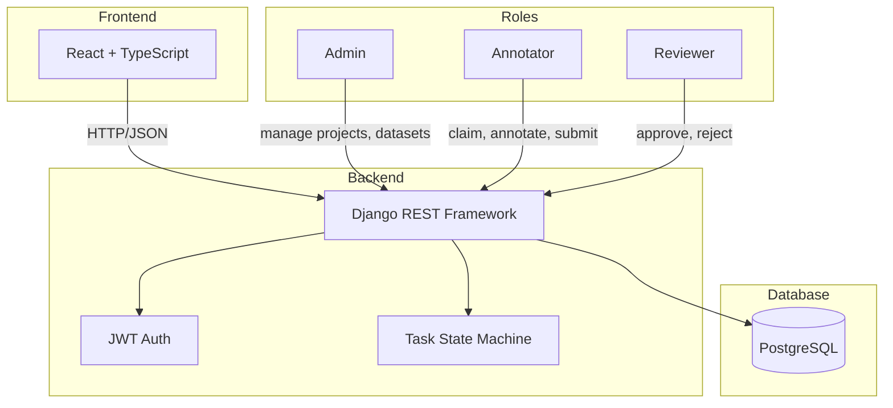
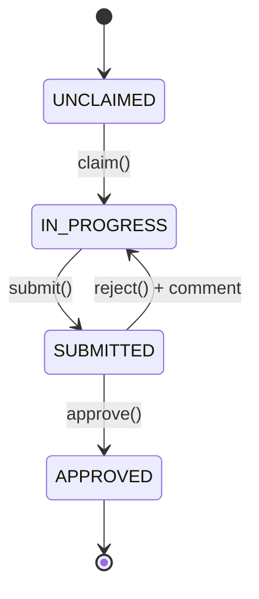

# LabelForge

A multi-user annotation & review platform inspired by real AI model training workflows.

> Built with React, TypeScript, Django REST Framework, PostgreSQL, and JWT Authentication.

---

## Architecture





---

## Quick Start

```bash
docker compose up --build
```

The app will be available at **http://localhost:5173**

API is available at **http://localhost:8000**

> On first run, migrations are applied automatically and demo data is seeded.

## Demo Credentials

| Role       | Username    | Password       |
|------------|-------------|----------------|
| Admin      | admin       | admin123       |
| Annotator  | annotator   | annotator123   |
| Reviewer   | reviewer    | reviewer123    |

---

## Role-Based Workflow

**Three roles** with enforced permissions:

| Role       | Can Do                                                   |
|------------|----------------------------------------------------------|
| Admin      | Create projects/datasets, bulk-create tasks, full access |
| Annotator  | Claim tasks, annotate, submit for review                 |
| Reviewer   | View submitted tasks, approve or reject with comments    |

**Task State Machine** prevents invalid transitions at the API level. For example, you cannot approve an unclaimed task or submit a task you don't own.

## Annotation Interface

- Dynamic label buttons generated from dataset configuration
- **Keyboard shortcuts**: Press `1`, `2`, `3`... to select labels, `Enter` to submit
- **Built-in timer** that tracks `time_spent_seconds` per task
- **Rejection feedback** displayed prominently when a task is returned for re-annotation
- Progress indicator showing current position in queue

## Review Pipeline

- Reviewers see a queue of submitted tasks
- Each task shows the text snippet, annotator username, and chosen label
- **Approve** with one click
- **Reject** requires an inline comment explaining the issue
- Rejected tasks return to the annotator's queue with feedback visible

## Quality Dashboard

- **Stats cards**: Total Tasks, Completed, Rejected, Completion Rate, Rejection Rate, Avg Time
- **Daily throughput chart**: Bar chart showing approved tasks per day
- **Label distribution**: Donut chart of label frequencies for approved tasks
- **Per-annotator table**: Done, Rejected, Rejection Rate, Avg Time per annotator
- Filter by project

---

## API Endpoints

### Auth
| Method | Endpoint              | Description              |
|--------|-----------------------|--------------------------|
| POST   | `/api/auth/login/`    | Get JWT tokens           |
| POST   | `/api/auth/register/` | Create user (admin only) |
| GET    | `/api/auth/me/`       | Get current user info    |

### Projects & Datasets
| Method | Endpoint                            | Description              |
|--------|-------------------------------------|--------------------------|
| GET    | `/api/projects/`                    | List all projects        |
| POST   | `/api/projects/`                    | Create project (admin)   |
| GET    | `/api/projects/{id}/`               | Project detail + datasets|
| POST   | `/api/projects/{id}/datasets/`      | Create dataset (admin)   |
| GET    | `/api/datasets/{id}/`               | Dataset detail           |
| GET    | `/api/datasets/{id}/tasks/`         | List tasks in dataset    |
| POST   | `/api/datasets/{id}/tasks/bulk/`    | Bulk create tasks (admin)|

### Task Workflow
| Method | Endpoint                   | Description                     |
|--------|----------------------------|---------------------------------|
| POST   | `/api/tasks/{id}/claim/`   | Claim an unclaimed task         |
| POST   | `/api/tasks/{id}/submit/`  | Submit annotation               |
| POST   | `/api/tasks/{id}/approve/` | Approve submitted task          |
| POST   | `/api/tasks/{id}/reject/`  | Reject with required comment    |

### Queues & Metrics
| Method | Endpoint                | Description                      |
|--------|-------------------------|----------------------------------|
| GET    | `/api/tasks/queue/`     | Annotation queue                 |
| GET    | `/api/tasks/review-queue/` | Review queue                  |
| GET    | `/api/metrics/`         | Quality metrics (filterable)     |
| GET    | `/health`               | Health check                     |

---

## Tech Stack

- **Frontend**: React, TypeScript, Vite, Recharts, React Router
- **Backend**: Python 3.11, Django, Django REST Framework
- **Auth**: JWT via djangorestframework-simplejwt
- **Database**: PostgreSQL 15
- **Infrastructure**: Docker, Docker Compose

---

## Portfolio Write-up

**LabelForge**
Tags: Full-Stack, React, TypeScript, Django, PostgreSQL, JWT Auth
Role: Full-Stack Developer
Category: Full-Stack

**Problem**: I spent months as an AI model trainer at Mindrift AI, evaluating LLM outputs and reviewing annotations. The workflow was always the same: claim a task, annotate it, submit for review, get feedback, iterate. But the tools we used were clunky — no quality metrics, no clear rejection feedback, no way to see how the team was performing.

**Tech Stack**: React, TypeScript, Django REST Framework, PostgreSQL, JWT Authentication

**Architecture**: React frontend communicates with a Django REST API backed by PostgreSQL. JWT handles authentication across three user roles. A task state machine enforces valid workflow transitions: unclaimed -> in_progress -> submitted -> approved/rejected.

**Key Challenges**: Designing a task state machine that prevents invalid transitions (e.g., can't approve an unclaimed task) while keeping the UX fluid, and building a quality dashboard that surfaces meaningful per-annotator performance metrics in real time.

**What I Shipped**: Multi-user annotation platform with 3 roles (Annotator, Reviewer, Admin), task state machine, annotation UI with keyboard shortcuts and built-in timer, review pipeline with inline rejection feedback, and a quality dashboard tracking rejection rates, throughput, and per-annotator performance.

**Impact**: Project managers get immediate visibility into data quality and annotator performance. Rejected tasks return to annotators with specific feedback, creating a closed feedback loop that improves annotation quality over time.

**Story**: I spent months as an AI model trainer at Mindrift AI, evaluating LLM outputs and reviewing annotations across datasets. The workflow was always the same: claim a task, annotate it, submit for review, get feedback, iterate. But the tools we used were clunky — no quality metrics, no clear rejection feedback, no way to see how the team was performing. LabelForge is the platform I wished existed. It's a multi-user annotation system with three roles: Annotators claim and label tasks, Reviewers approve or reject with inline comments, and Admins manage projects and monitor quality. The dashboard tracks rejection rates, throughput, and per-annotator performance in real time. This isn't a theoretical exercise — it's built from real experience with real annotation workflows.

---

## What I'd Add Next

- NER (Named Entity Recognition) highlighting for span-level annotations
- Cohen's Kappa inter-annotator agreement metrics
- WebSocket notifications for real-time task assignment updates
- CSV/JSON export of annotation results and metrics
